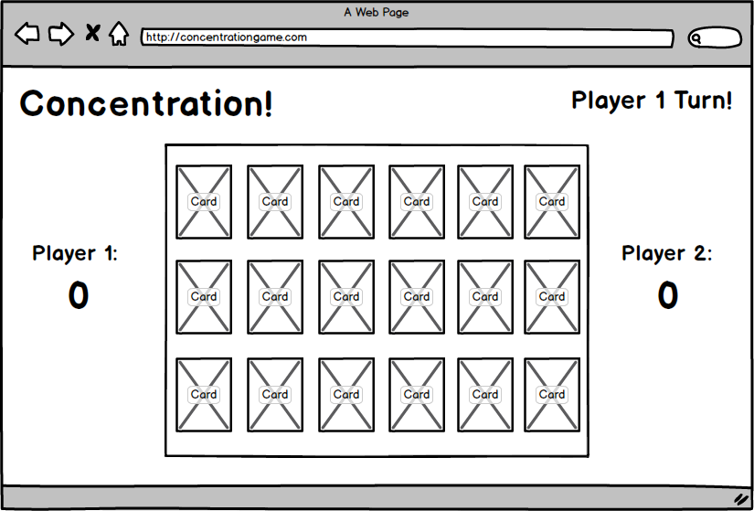

# Concentration!

### WDI-SM-23 Project 1

The object of Concentration is to turn over the most pairs of matching cards.

### Instructions:

* The cards begin face-down. 
* Turn by turn, each player picks two cards to turn over, attempting to select cards that will have both matching numbers and colors.
* When a player makes a match, he or she gets a point and another turn to pick.
* If no match is made in a turn, the cards are turned back over and it is the other player's turn to pick.
* When one pair of cards is left, the current player receives the point for the last match and the game ends. 
* Whichever player has the most points wins.

### User Stories:

* As a player, I want to be able to click face-down cards to see what their numbers and colors are in order to make matches and win points.
* As a player, I want to know as the game proceeds what cards are left to match up.
* As a player, I want to know after I've made a match that I have gotten the correct point for the match.
* As a player, I want to know if it's my turn or not.

### Technologies:

HTML, CSS, Javascript, jQuery

### Other:

Used to shuffle Card order in-DOM: [https://css-tricks.com/snippets/jquery/shuffle-dom-elements/]()

Sound clips: [http://soundbible.com/]()

### Wireframe:

### Future Implementations:
* Multiple difficulty modes
* Start and end screens
* In-game quit/start over with pop-up screen

